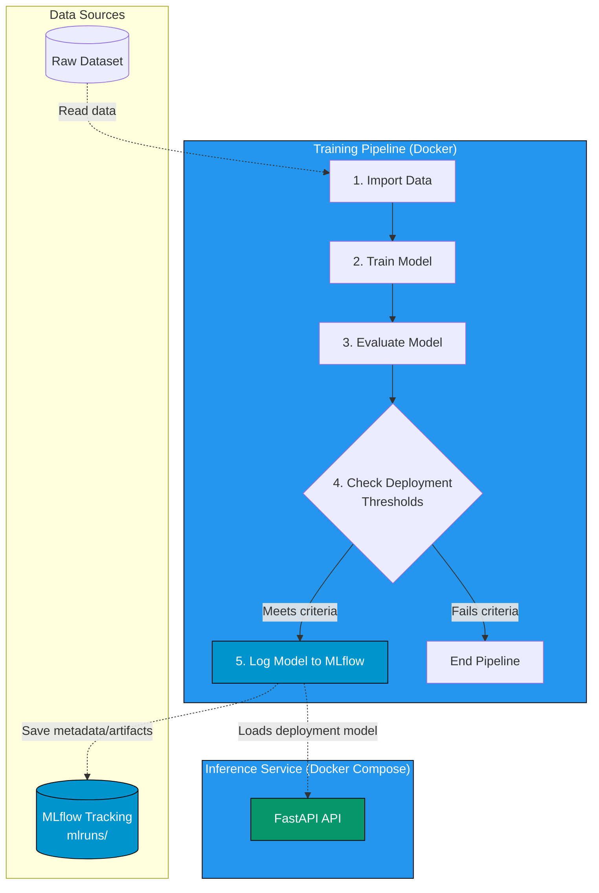

# Is This HotDog

Hotdog vs not-hotdog classification project with:

- training/evaluation pipeline
- MLflow model logging
- FastAPI inference service
- Docker support for pipeline and API

## 1. Prerequisite

Install and start Docker Desktop.

## 2. Train and Evaluate (Docker)

Build image:

```bash
docker build -t hotdog-pipeline .
```

Run the full pipeline in a container:

```bash
docker run --rm -v "%cd%\mlruns:/app/mlruns" -v "%cd%\dataset:/app/dataset" hotdog-pipeline
```

### Pipeline Architecture



Pipeline steps detailed:

1. **Import data**: Format images from `data/raw/` (or `dataset/`).
2. **Train model**: Fine-tune classification model using TensorFlow/Keras.
3. **Evaluate model**: Run performance metrics against the test set.
4. **Check deployment thresholds**: Compare precision/recall against target.
5. **Log model**: Save model artifacts and run details via MLflow.

## 3. Run API (Docker Compose)

Start API service:

```bash
docker compose up --build api
```

Stop services:

```bash
docker compose down
```

API endpoints:

- Swagger UI: http://localhost:8000/docs
- ReDoc: http://localhost:8000/redoc

## 4. Test Prediction Endpoint

Single image:

```bash
curl -X POST "http://localhost:8000/predict" -F "file=@path/to/image.jpg"
```

Health check:

```bash
curl "http://localhost:8000/health"
```

API will be available at:

- http://localhost:8000

## 5. CI/CD Pipeline (GitHub Actions)

This project features an automated Continuous Integration/Continuous Deployment (CI/CD) pipeline powered by GitHub Actions.
It triggers automatically upon pushing code to the `main` or `master` branches.

### Pipeline execution steps:

1. **Tests Execution**: Ensures tests and utilities are running smoothly using `pytest` inside an isolated python environment.
2. **Docker Build**: Pulls system dependencies and verifies the container architecture works flawlessly.
3. **Publish to GHCR**: Pushes the verified and built `hotdog-pipeline` Docker images into the GitHub Container Registry (`ghcr.io`).

## 6. Project Notes

- Class imbalance can reduce recall/precision for `hotdog` if training data is skewed.
- More training data and augmentation generally improve generalization.
- Transfer learning (MobileNetV2) is preferred over training a CNN from scratch with limited data.
